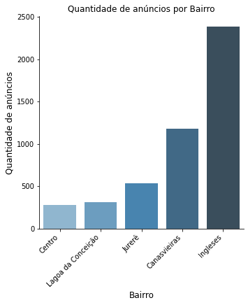
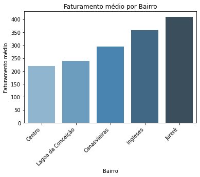

  

# 🚀 Seazone Code Challenge - Data Science

## 💻 Código completo no Colab

[Abrir no Colab](https://colab.research.google.com/drive/1H5VC3OMgPVSrZcWJ1ZHbrrNjtDCjuN6P?usp=sharing)

## 📝 Descrição do desafio

O desafio consiste em analisar os dados de ocupação e preço de anúncios no Airbnb em Florianópolis-SC, mais especificamente nos bairros: Canasvieiras, Centro, Ingleses, Jurerê e Lagoa da Conceição.

Deseja-se:

1.  Ordenar os bairros em ordem crescente de número de anúncios (*airbnb_listing_id*);
2.  Ordenar os bairros em ordem crescente de faturamento médio dos anúncios (*airbnb_listing_id*);
3.  Verificar se há correlações entre as características de um anúncio e seu faturamento;
4.  Calcular a antecedência média das reservas e se esse número é maior ou menor no caso de reservas para os finais de semana.  

## 📊 Resultados

### 1 - Ordenar os bairros em ordem crescente de número de anúncios

O número de anúncios para cada bairro pode ser observado na tabela 1 e figura 1.

#### Tabela 1 - Nº de anúncios por bairro
|Bairro| Nº de anúncios|
|--|--|
|Centro|278|
|Lagoa da Conceição|309|
|Jurerê|539|
|Canasvieiras|1177|
|Ingleses|2388|

      
#### Figura 1 - Nº de anúncios por bairro

      
### 2 - Ordenar os bairros em ordem crescente de faturamento médio dos anúncios
O faturamento médio para cada bairro pode ser observado na tabela 2 e figura 2.
      
#### Tabela 2 - Faturamento médio por bairro
|Bairro| Faturamento médio|
|--|--|
|Centro|218,73|
|Lagoa da Conceição|239,89|
|Canasvieiras|294,16|
|Ingleses|358,26|
|Jurerê|409,61|

      
#### Figura 2 – Faturamento médio por bairro

      
### 3 - Verificar se há correlações entre as características de um anúncio e seu faturamento

As correlações obtidas podem ser observadas na figura 3.
Algumas variáveis foram renomeadas apenas para efeito de apresentação:

    • “number_of_bedrooms” = “Nº de quartos”;
    • “number_of_bathrooms” = “Nº de banheiros”;
    • “star_rating” = “Classificação”;
    • “is_superhost” = “Superhost”;
    • “number_of_reviews” = “Nº Reviews”.

       
#### Figura 3 – Correlações entre faturamento e características do anúncio

       
### 4 - Verificar qual antecedência média das reservas e se esse número é maior ou menor no caso de reservas para os finais de semana

A **antecedência** média geral das reservas é de 32 dias e 8,465 horas

Quando essa reserva é feita exclusivamente **para os fins de semana**, a antecedência média é de 32 dias e 10,6467 horas.

Portanto a antecedência média geral é menor (por pouco) que a antecedência média de reservas feitas exclusivamente para os fins de semana.

